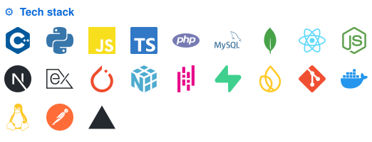
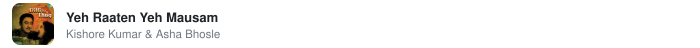
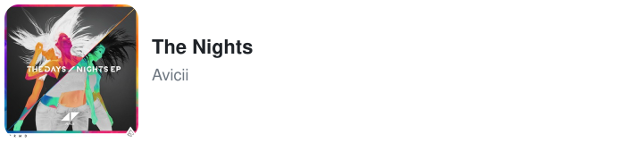
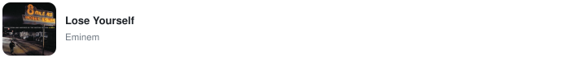
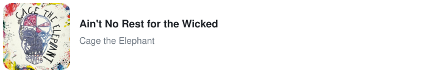

##### Hi, I'm Eesh 👋

> Want to know what I'm currently working on ?\
> Checkout [my todos](https://github.com/users/eeshsaxena/projects/3)
>
> *PS: juggling a Kaggle competition, a portfolio launch and some research right now, moving a bit slower than planned but the bricks are stacking up !*
>
> - [ ] [`Kaggle`](https://www.kaggle.com/competitions/ai-agent-security-multi-step-tool-attacks/leaderboard) AI Agent Security competition, my top priority right now
> - [ ] [`Portfolio`](https://eeshsaxena.com) will be my personal site, live at eeshsaxena.com
> - [ ] `BolKota` will be a Rajasthani voice assistant (ASR + NLU)
> - [ ] `Cardiac Edge AI` will run on-device ECG anomaly detection on an MCU
> - [ ] [`RajNLP-50K`](https://github.com/eeshsaxena/rajnlp-50k) is the first open Rajasthani-Hindi code-switched corpus (50k)
> - [ ] [`Distributed File Storage`](https://github.com/eeshsaxena/distributed-file-storage) handles chunking, replication & encryption
>   - currently learning Graph RAG, TinyML & low-resource NLP
>
> *Thanks for stopping by! Open to research internships & collaborations.*

<!--
  Every panel is generated by YOUR OWN lowlighter/metrics workflow and committed to this
  repo as an .svg (self-hosted, no third-party card services). Two-column table (not
  floats): each td stacks its own images tightly, so mismatched panel heights on one
  side never push a gap into the other side.
-->

<!--
  Layout: each block is ONE row = a single left float + a single right column, then a
  100%-wide placeholder that forces a clear. Rows are paired by panel height so neither
  side waits on a much taller neighbour:
    row 1  header (92)          |  contact (inline pair, identical aspect)
    row 2  activity/etc (257)   |  tech stack (200)
    row 3  anime (384)          |  recently starred (345)
    row 4+ on repeat: header, then songs two per row (equal heights)
-->

<!-- header + contact are both 480x92, so plain inline imgs on ONE line sit perfectly level (no floats needed) -->

<!-- Bottom: live "last updated" date + credit -->

  

