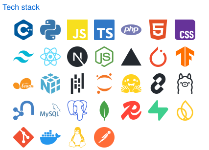
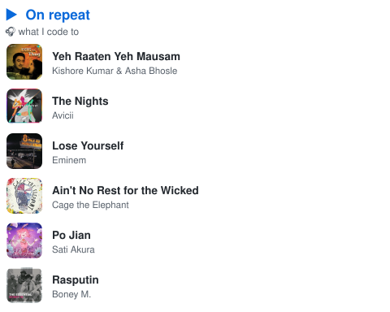

##### Hi, I'm Eesh 👋

> Want to know what I'm currently working on ?\
> Checkout [my todos](https://github.com/users/eeshsaxena/projects/3)
>
> *PS: juggling a Kaggle competition, a portfolio launch and some research right now, moving a bit slower than planned but the bricks are stacking up !*
>
> - [ ] [`Kaggle`](https://www.kaggle.com/competitions/ai-agent-security-multi-step-tool-attacks/leaderboard) AI Agent Security competition, my top priority right now
> - [ ] [`Portfolio`](https://eeshsaxena.com) will be my personal site, live at eeshsaxena.com
> - [ ] `BolKota` will be a Rajasthani voice assistant (ASR + NLU)
> - [ ] `Cardiac Edge AI` will run on-device ECG anomaly detection on an MCU
> - [ ] [`RajNLP-50K`](https://github.com/eeshsaxena/rajnlp-50k) is the first open Rajasthani-Hindi code-switched corpus (50k)
> - [ ] [`Distributed File Storage`](https://github.com/eeshsaxena/distributed-file-storage) handles chunking, replication & encryption
>   - currently learning Graph RAG, TinyML & low-resource NLP
>
> *Thanks for stopping by! Open to research internships & collaborations.*

<!--
  Every panel is generated by YOUR OWN lowlighter/metrics workflow and committed to this
  repo as an .svg (self-hosted, no third-party card services). Two-column table (not
  floats): each td stacks its own images tightly, so mismatched panel heights on one
  side never push a gap into the other side.
-->

<!--
  LAYOUT RULES (measured in a real browser on this page, do not "simplify"):
   1. GitHub forces `display:block` on every markdown image, so inline pairs are
      impossible: two images side by side REQUIRE align="left" / align="right" floats.
   2. GitHub resolves the width % against a box wider than the readme column, so
      width="49%" actually renders ~51%. Two of those overflow 831px and the right
      float drops below the left one. 47% renders 411px each (822 < 831) and holds.
   3. A right-hand COLUMN of several images = one left float followed by consecutive
      right floats. A wrapper 
 cannot be used: it is full width and clears the float.
   4. Each row ends with a 100%-wide placeholder, which cannot fit beside a float and
      therefore acts as the clear.
-->

<!-- Contact rows are separate images so each can carry its own link (links inside an
     SVG stop working once GitHub renders the SVG as an ). -->

<!-- CP rows are separate images so each can carry its own link (links inside an SVG
     stop working once GitHub renders the SVG as an ). -->

